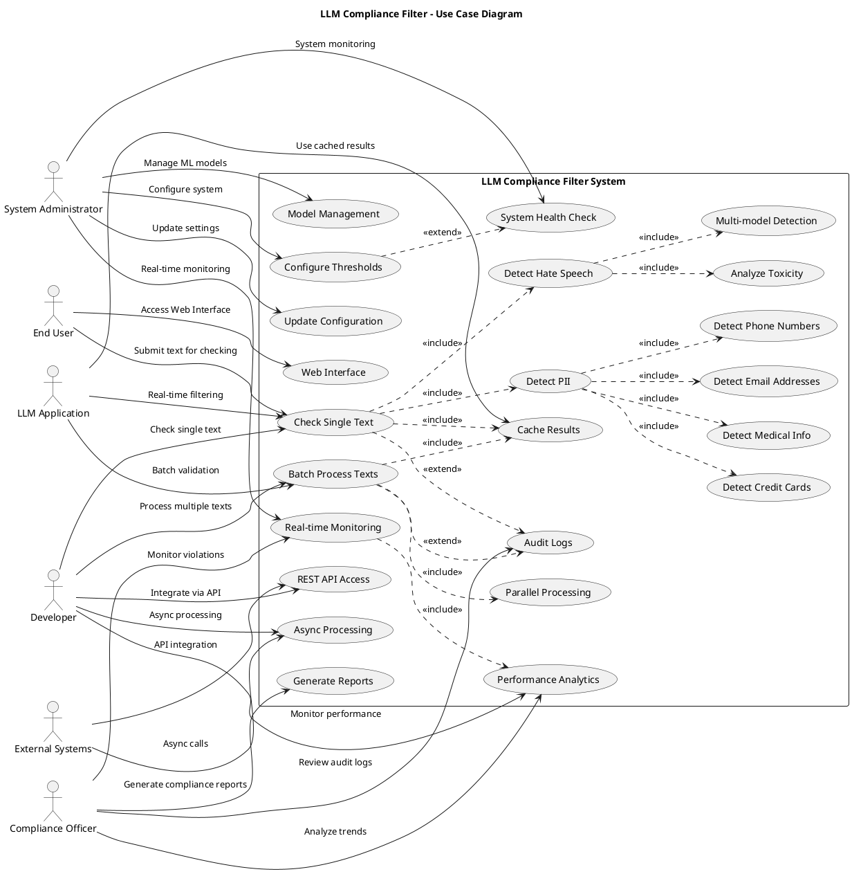

# Use Case Diagram - LLM Compliance Filter System

## System Overview
The LLM Compliance Filter System provides comprehensive content filtering for Large Language Model applications, detecting privacy violations and hate speech in user prompts.

## PlantUML Code

## Actor Descriptions

### End User
- **Role**: Direct user of the web interface
- **Responsibilities**: Submit text for compliance checking, view results
- **Use Cases**: Access web interface, submit single text checks

### Developer
- **Role**: Software developer integrating the compliance filter
- **Responsibilities**: Implement API calls, handle responses, monitor performance
- **Use Cases**: API integration, single/batch processing, performance monitoring

### System Administrator
- **Role**: Technical administrator managing the system
- **Responsibilities**: System configuration, model management, monitoring
- **Use Cases**: Configure thresholds, update settings, manage models, system health

### Compliance Officer
- **Role**: Business stakeholder ensuring regulatory compliance
- **Responsibilities**: Monitor violations, generate reports, analyze trends
- **Use Cases**: Generate reports, review logs, monitor real-time violations

### LLM Application
- **Role**: External application using the compliance filter
- **Responsibilities**: Send prompts for filtering, handle compliance responses
- **Use Cases**: Real-time filtering, batch validation, caching

### External Systems
- **Role**: Third-party systems integrating via API
- **Responsibilities**: API calls, data exchange, async processing
- **Use Cases**: API integration, async processing

## Use Case Details

### Core Processing
- **UC1 - Check Single Text**: Process individual text for compliance violations
- **UC2 - Batch Process Texts**: Process multiple texts efficiently in parallel
- **UC3 - Real-time Monitoring**: Monitor system performance and violations in real-time

### Privacy Detection
- **UC6-UC10**: Detect various types of personally identifiable information (PII)
- Includes email addresses, phone numbers, credit cards, medical information

### Hate Speech Detection
- **UC11-UC13**: Detect hate speech and toxic content using ML models
- Supports multiple model types and multi-class detection

### Performance Optimization
- **UC14-UC16**: Caching, parallel processing, and performance analytics
- Includes intelligent multi-tier caching and real-time metrics

### System Management
- **UC17-UC20**: Configuration management, model updates, and health monitoring
- Supports dynamic threshold updates and model switching

### API and Integration
- **UC21-UC23**: REST API, web interface, and asynchronous processing
- Provides multiple integration options for different use cases

## Business Value

1. **Compliance Assurance**: Ensures LLM applications meet privacy and content standards
2. **Risk Mitigation**: Prevents exposure of sensitive data and inappropriate content
3. **Performance Optimization**: High-throughput processing with intelligent caching
4. **Flexibility**: Configurable thresholds and multiple integration options
5. **Monitoring**: Comprehensive logging and real-time monitoring capabilities
6. **Scalability**: Supports both real-time and batch processing scenarios

## Technical Requirements

1. **Functional Requirements**: All use cases must be implemented with proper error handling
2. **Performance Requirements**: Sub-100ms response time for cached results
3. **Scalability Requirements**: Support for 1000+ requests per second
4. **Security Requirements**: Secure handling of sensitive data and audit trails
5. **Integration Requirements**: RESTful API and multiple client libraries
