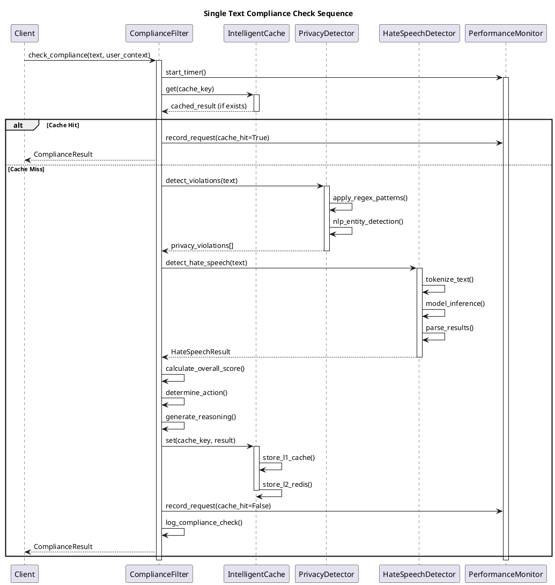
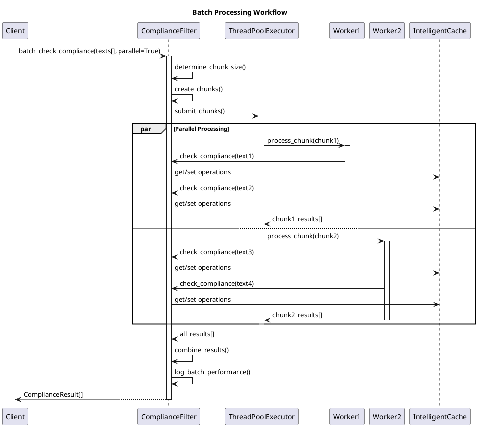
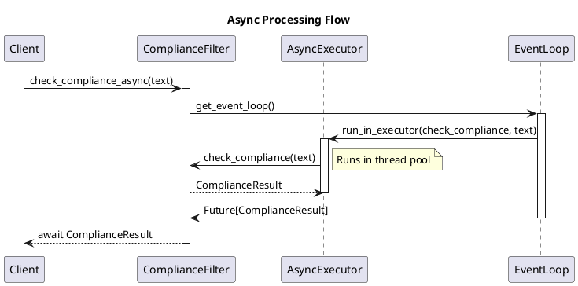
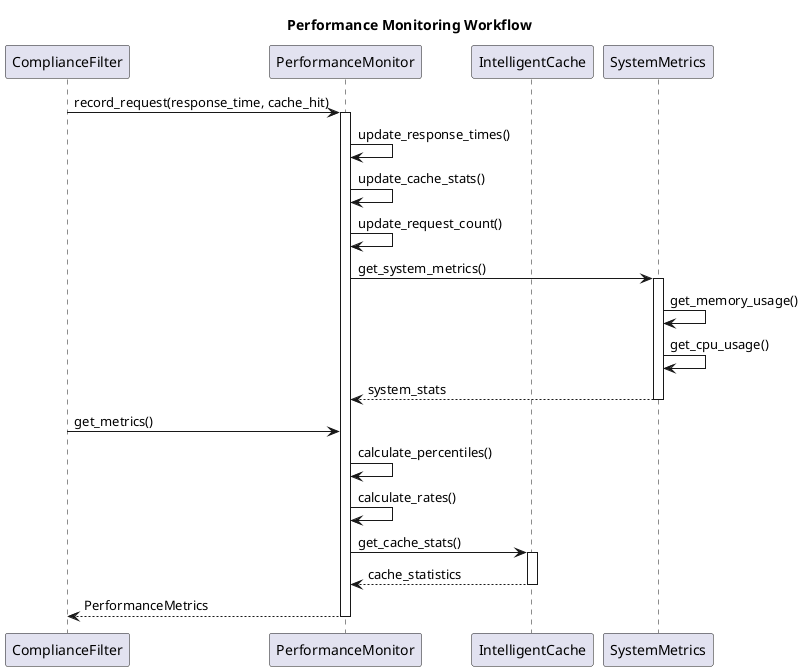
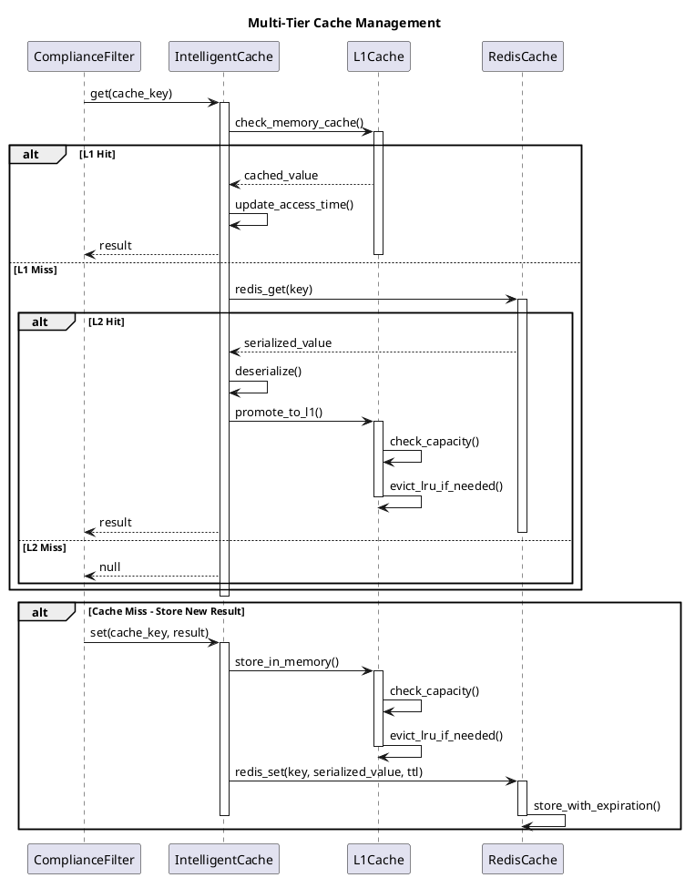
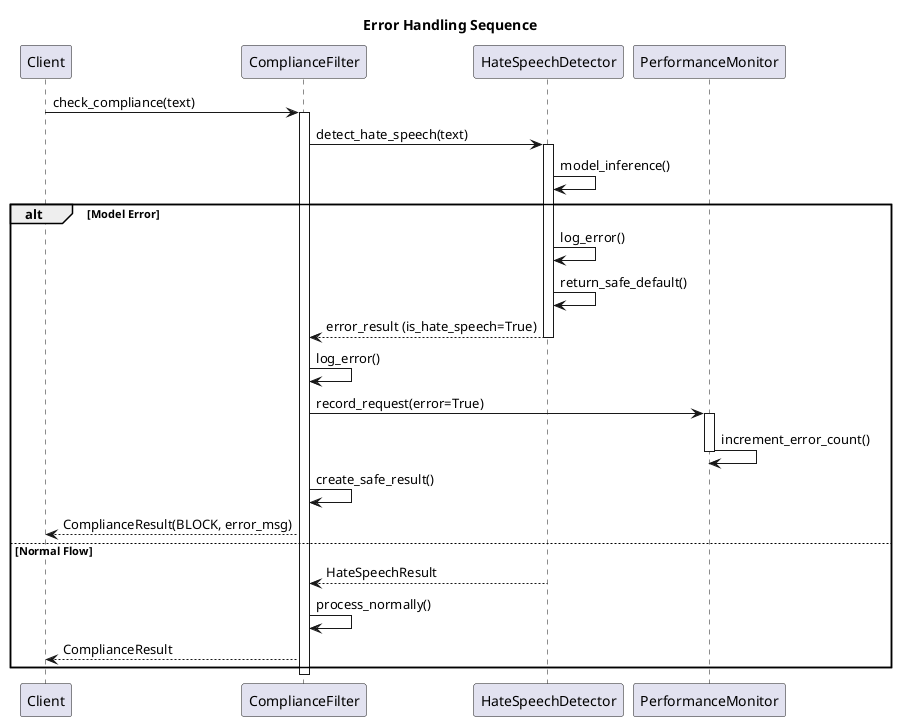
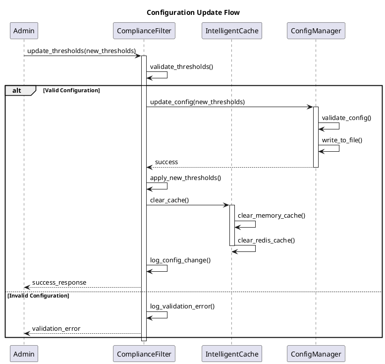

# Sequence Diagrams - LLM Compliance Filter System

## Overview
This document contains sequence diagrams for the key workflows in the LLM Compliance Filter System, showing the interactions between different components over time.

## 1. Single Text Compliance Check

## 2. Batch Processing Workflow

## 3. Async Processing Flow

## 4. Performance Monitoring Workflow

## 5. Cache Management Flow

## 6. Error Handling Sequence

## 7. Configuration Update Flow

## Sequence Diagram Analysis

### Key Patterns Identified

1. **Cache-First Pattern**: All requests check cache before processing
2. **Parallel Processing**: Batch operations use thread pools for scalability
3. **Error Resilience**: Comprehensive error handling with safe defaults
4. **Performance Monitoring**: Every operation is tracked for metrics
5. **Multi-Tier Caching**: L1 (memory) + L2 (Redis) for optimal performance

### Performance Characteristics

1. **Cache Hit Path**: ~1-5ms response time
2. **Cache Miss Path**: ~50-200ms response time (depending on ML models)
3. **Batch Processing**: Linear scalability with worker threads
4. **Error Recovery**: Graceful degradation with safe defaults

### Integration Points

1. **Client Integration**: Simple async/sync API calls
2. **Cache Integration**: Transparent multi-tier caching
3. **Monitoring Integration**: Built-in performance tracking
4. **Configuration**: Hot-reload of settings without restart

This sequence diagram documentation provides a comprehensive view of how the system components interact during runtime, making it easier for developers to understand the flow and optimize performance.
