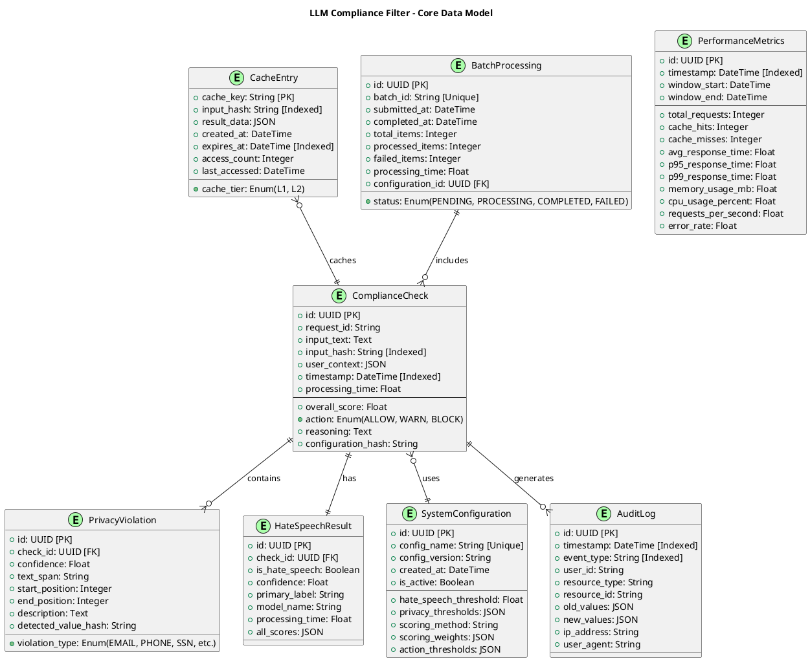

# Entity Relationship Diagrams - LLM Compliance Filter System

## Overview
This document contains Entity Relationship Diagrams (ERDs) for the data model of the LLM Compliance Filter System, showing the relationships between different data entities.

## 1. Core Data Model ERD



## 2. Performance and Monitoring ERD

```plantuml
@startuml PerformanceMonitoringERD
title Performance and Monitoring Data Model

Entity(SystemMetrics, "SystemMetrics") {
    + id: UUID [PK]
    + timestamp: DateTime [Indexed]
    + metric_type: String [Indexed]
    + host_name: String
    --
    + memory_usage_mb: Float
    + memory_peak_mb: Float
    + cpu_usage_percent: Float
    + disk_usage_mb: Float
    + network_io_mb: Float
    + process_count: Integer
    + thread_count: Integer
    + open_files_count: Integer
}

Entity(CacheStatistics, "CacheStatistics") {
    + id: UUID [PK]
    + timestamp: DateTime [Indexed]
    + cache_tier: Enum(L1, L2, COMBINED)
    --
    + total_requests: Integer
    + hits: Integer
    + misses: Integer
    + hit_rate_percent: Float
    + evictions: Integer
    + cache_size: Integer
    + memory_usage_mb: Float
}

Entity(DetectorPerformance, "DetectorPerformance") {
    + id: UUID [PK]
    + timestamp: DateTime [Indexed]
    + detector_type: Enum(PRIVACY, HATE_SPEECH)
    + model_name: String
    --
    + total_requests: Integer
    + avg_processing_time: Float
    + p95_processing_time: Float
    + p99_processing_time: Float
    + error_count: Integer
    + success_rate_percent: Float
}

Entity(ErrorLog, "ErrorLog") {
    + id: UUID [PK]
    + timestamp: DateTime [Indexed]
    + error_type: String [Indexed]
    + severity: Enum(LOW, MEDIUM, HIGH, CRITICAL)
    + component: String
    + error_message: Text
    + stack_trace: Text
    + context_data: JSON
    + request_id: String
    + resolved: Boolean
}

SystemMetrics ||--o{ CacheStatistics : monitors
SystemMetrics ||--o{ DetectorPerformance : tracks
SystemMetrics ||--o{ ErrorLog : logs

@enduml
```

## 3. Configuration and Security ERD

```plantuml
@startuml ConfigurationSecurityERD
title Configuration and Security Data Model

Entity(UserSession, "UserSession") {
    + session_id: String [PK]
    + user_id: String [Indexed]
    + created_at: DateTime
    + expires_at: DateTime [Indexed]
    + ip_address: String
    + user_agent: String
    + is_active: Boolean
}

Entity(ApiKey, "ApiKey") {
    + key_id: UUID [PK]
    + api_key_hash: String [Unique]
    + key_name: String
    + created_by: String
    + created_at: DateTime
    + expires_at: DateTime [Indexed]
    + last_used: DateTime
    + usage_count: Integer
    + rate_limit: Integer
    + is_active: Boolean
}

Entity(UserRole, "UserRole") {
    + id: UUID [PK]
    + user_id: String
    + role_name: Enum(ADMIN, USER, VIEWER)
    + granted_by: String
    + granted_at: DateTime
    + expires_at: DateTime
    + is_active: Boolean
}

Entity(ConfigurationHistory, "ConfigurationHistory") {
    + id: UUID [PK]
    + config_id: UUID [FK]
    + changed_by: String
    + changed_at: DateTime [Indexed]
    + change_type: Enum(CREATE, UPDATE, DELETE)
    + field_name: String
    + old_value: Text
    + new_value: Text
    + change_reason: Text
}

Entity(ComplianceReport, "ComplianceReport") {
    + id: UUID [PK]
    + report_name: String
    + generated_by: String
    + generated_at: DateTime [Indexed]
    + period_start: DateTime
    + period_end: DateTime
    + report_type: Enum(SUMMARY, DETAILED, VIOLATIONS)
    + report_data: JSON
    + file_path: String
}

UserSession }o--|| UserRole : has
ApiKey }o--|| UserRole : belongs_to
ConfigurationHistory }o--|| SystemConfiguration : tracks
ComplianceReport }o--|| UserSession : generated_by

@enduml
```

## 4. ML Model and Training Data ERD

```plantuml
@startuml MLModelERD
title ML Model and Training Data Model

Entity(ModelRegistry, "ModelRegistry") {
    + model_id: UUID [PK]
    + model_name: String [Unique]
    + model_type: Enum(HATE_SPEECH, PRIVACY)
    + model_version: String
    + file_path: String
    + file_size_mb: Float
    + created_at: DateTime
    + is_active: Boolean
    + performance_metrics: JSON
    + training_data_id: UUID [FK]
}

Entity(TrainingData, "TrainingData") {
    + id: UUID [PK]
    + dataset_name: String
    + dataset_version: String
    + created_at: DateTime
    + sample_count: Integer
    + data_source: String
    + validation_split: Float
    + test_split: Float
    + data_hash: String
}

Entity(ModelPerformance, "ModelPerformance") {
    + id: UUID [PK]
    + model_id: UUID [FK]
    + evaluation_date: DateTime [Indexed]
    + dataset_type: Enum(TRAINING, VALIDATION, TEST)
    --
    + accuracy: Float
    + precision: Float
    + recall: Float
    + f1_score: Float
    + auc_roc: Float
    + confusion_matrix: JSON
    + evaluation_time: Float
}

Entity(FeedbackData, "FeedbackData") {
    + id: UUID [PK]
    + check_id: UUID [FK]
    + provided_by: String
    + provided_at: DateTime [Indexed]
    + feedback_type: Enum(CORRECT, INCORRECT, PARTIAL)
    + expected_action: Enum(ALLOW, WARN, BLOCK)
    + actual_action: Enum(ALLOW, WARN, BLOCK)
    + comments: Text
    + is_processed: Boolean
}

ModelRegistry ||--|| TrainingData : uses
ModelRegistry ||--o{ ModelPerformance : evaluated_by
FeedbackData }o--|| ComplianceCheck : provides_feedback_on

@enduml
```

## Database Schema Implementation

### Primary Keys and Indexes

```sql
-- Core table indexes for performance
CREATE INDEX idx_compliance_check_timestamp ON ComplianceCheck(timestamp);
CREATE INDEX idx_compliance_check_hash ON ComplianceCheck(input_hash);
CREATE INDEX idx_privacy_violation_check_id ON PrivacyViolation(check_id);
CREATE INDEX idx_hate_speech_result_check_id ON HateSpeechResult(check_id);

-- Performance monitoring indexes
CREATE INDEX idx_performance_metrics_timestamp ON PerformanceMetrics(timestamp);
CREATE INDEX idx_cache_entry_expires ON CacheEntry(expires_at);
CREATE INDEX idx_audit_log_timestamp ON AuditLog(timestamp);
CREATE INDEX idx_audit_log_event_type ON AuditLog(event_type);

-- Security and configuration indexes
CREATE INDEX idx_user_session_expires ON UserSession(expires_at);
CREATE INDEX idx_api_key_expires ON ApiKey(expires_at);
CREATE INDEX idx_config_history_changed_at ON ConfigurationHistory(changed_at);
```

### Data Retention Policies

```sql
-- Automatic cleanup of old data
-- Cache entries: 24 hours
DELETE FROM CacheEntry WHERE expires_at < NOW() - INTERVAL '24 hours';

-- Performance metrics: 30 days detailed, 1 year aggregated  
DELETE FROM PerformanceMetrics WHERE timestamp < NOW() - INTERVAL '30 days';

-- Audit logs: 2 years
DELETE FROM AuditLog WHERE timestamp < NOW() - INTERVAL '2 years';

-- Expired sessions and API keys
DELETE FROM UserSession WHERE expires_at < NOW();
DELETE FROM ApiKey WHERE expires_at < NOW() AND is_active = false;
```

## Data Relationships Summary

### Key Relationships:

1. **ComplianceCheck** is the central entity containing the main processing results
2. **PrivacyViolation** and **HateSpeechResult** are child entities providing detailed findings
3. **CacheEntry** provides performance optimization through result caching
4. **PerformanceMetrics** enables system monitoring and optimization
5. **SystemConfiguration** manages system behavior and thresholds
6. **AuditLog** provides comprehensive audit trail for compliance
7. **BatchProcessing** manages bulk processing operations

### Data Flow:

1. **Input** → ComplianceCheck (with configuration)
2. **Processing** → PrivacyViolation + HateSpeechResult
3. **Result** → CacheEntry (for future use)
4. **Monitoring** → PerformanceMetrics + SystemMetrics
5. **Auditing** → AuditLog (all operations)
6. **Feedback** → FeedbackData (for model improvement)

This ERD provides a comprehensive data model that supports all aspects of the LLM Compliance Filter system, from core processing to performance monitoring, security, and model management.
