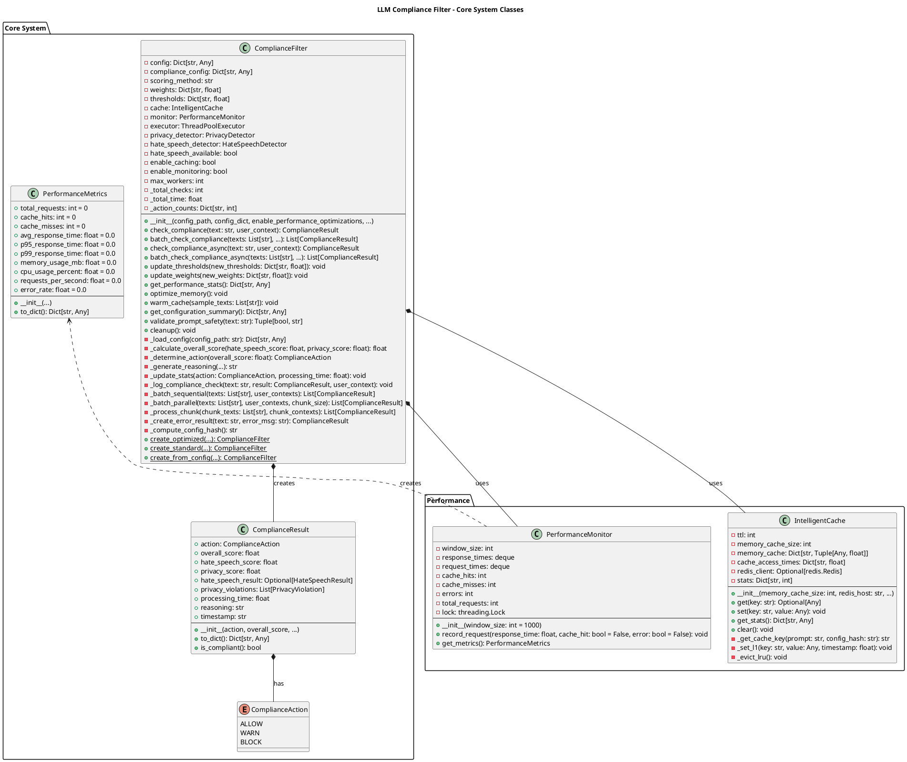
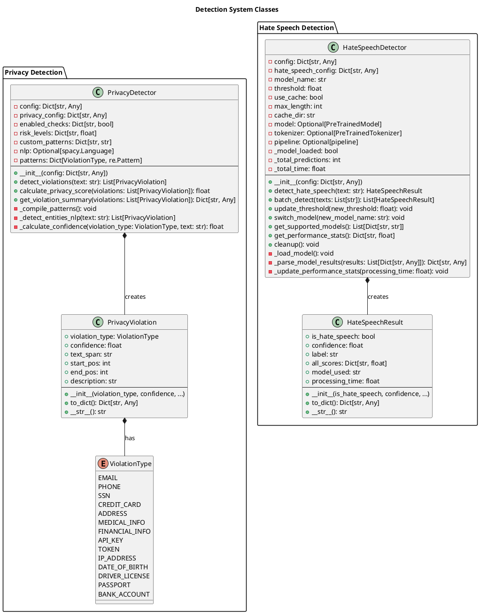
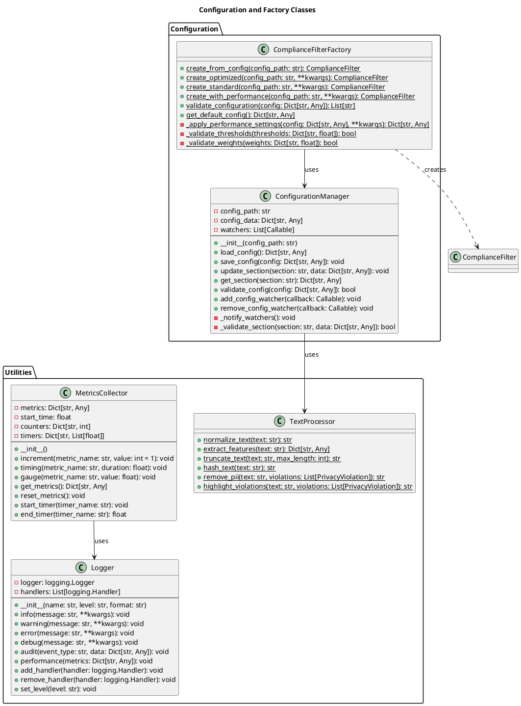
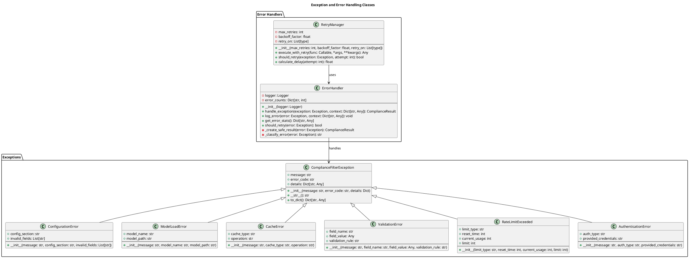

# Class Diagrams - LLM Compliance Filter System

## Overview
This document contains detailed class diagrams for the LLM Compliance Filter System, showing all classes, their relationships, methods, and attributes.

## 1. Core System Class Diagram

## 2. Detection System Class Diagram

## 3. Configuration and Factory Classes

## 4. Web API and Integration Classes

```plantuml
@startuml WebAPIClasses
title Web API and Integration Classes

package "Web API" {
    
    class FlaskApp {
        -app: Flask
        -compliance_filter: ComplianceFilter
        -rate_limiter: RateLimiter
        -auth_manager: AuthManager
        --
        +__init__(compliance_filter: ComplianceFilter)
        +create_app(): Flask
        +setup_routes(): void
        +setup_middleware(): void
        +setup_error_handlers(): void
        +run(host: str, port: int, debug: bool): void
    }

    class APIController {
        -compliance_filter: ComplianceFilter
        -logger: Logger
        --
        +__init__(compliance_filter: ComplianceFilter)
        +check_single_text(request: Request): Response
        +check_batch_texts(request: Request): Response
        +get_performance_stats(request: Request): Response
        +update_configuration(request: Request): Response
        +health_check(request: Request): Response
        -_validate_request(request: Request, schema: Dict): bool
        -_format_response(data: Any, status_code: int): Response
        -_handle_error(error: Exception): Response
    }

    class RateLimiter {
        -limits: Dict[str, int]
        -windows: Dict[str, int]
        -storage: Dict[str, Dict[str, Any]]
        --
        +__init__(limits: Dict[str, int])
        +is_allowed(key: str, limit_type: str): bool
        +get_remaining(key: str, limit_type: str): int
        +reset_limit(key: str, limit_type: str): void
        -_get_window_key(key: str, window_size: int): str
        -_cleanup_expired(): void
    }

    class AuthManager {
        -api_keys: Dict[str, Dict[str, Any]]
        -sessions: Dict[str, Dict[str, Any]]
        --
        +__init__(config: Dict[str, Any])
        +validate_api_key(api_key: str): Optional[Dict[str, Any]]
        +validate_session(session_id: str): Optional[Dict[str, Any]]
        +create_session(user_id: str): str
        +revoke_session(session_id: str): bool
        +create_api_key(user_id: str, permissions: List[str]): str
        +revoke_api_key(api_key: str): bool
        -_hash_key(key: str): str
        -_generate_key(): str
    }
}

package "Client SDKs" {
    
    class PythonClient {
        -base_url: str
        -api_key: str
        -timeout: int
        -session: requests.Session
        --
        +__init__(base_url: str, api_key: str, timeout: int)
        +check_compliance(text: str, user_context: Dict): ComplianceResult
        +batch_check_compliance(texts: List[str]): List[ComplianceResult]
        +get_performance_stats(): Dict[str, Any]
        +update_configuration(config: Dict[str, Any]): bool
        -_make_request(method: str, endpoint: str, data: Dict): Dict
        -_handle_response(response: requests.Response): Dict
    }

    class AsyncPythonClient {
        -base_url: str
        -api_key: str
        -timeout: int
        -session: aiohttp.ClientSession
        --
        +__init__(base_url: str, api_key: str, timeout: int)
        +async check_compliance(text: str, user_context: Dict): ComplianceResult
        +async batch_check_compliance(texts: List[str]): List[ComplianceResult]
        +async get_performance_stats(): Dict[str, Any]
        -async _make_request(method: str, endpoint: str, data: Dict): Dict
        -async _handle_response(response: aiohttp.ClientResponse): Dict
        +async __aenter__(): AsyncPythonClient
        +async __aexit__(exc_type, exc_val, exc_tb): void
    }
}

' Web API relationships
FlaskApp *-- APIController : uses
FlaskApp *-- RateLimiter : uses
FlaskApp *-- AuthManager : uses
APIController --> ComplianceFilter : uses
PythonClient ..> APIController : calls
AsyncPythonClient ..> APIController : calls

@enduml
```

## 5. Exception and Error Handling Classes

## Class Relationships Summary

### Key Design Patterns Used:

1. **Factory Pattern**: `ComplianceFilterFactory` creates different types of compliance filters
2. **Strategy Pattern**: Different scoring methods (weighted_average, max, product)
3. **Observer Pattern**: Configuration watchers for hot-reload
4. **Decorator Pattern**: Performance monitoring and caching decorators
5. **Singleton Pattern**: Logger and metrics collector
6. **Command Pattern**: API endpoints as commands
7. **Template Method Pattern**: Base detection classes with specific implementations

### Core Dependencies:

1. **ComplianceFilter** depends on:
   - PrivacyDetector, HateSpeechDetector (detection)
   - IntelligentCache, PerformanceMonitor (performance)
   - ConfigurationManager (configuration)

2. **Detection System** is independent and pluggable
3. **Performance System** provides cross-cutting concerns
4. **Web API** wraps core functionality with HTTP interface
5. **Error Handling** provides consistent error management

### Extensibility Points:

1. **New Detectors**: Implement base detection interface
2. **New Cache Backends**: Implement cache interface
3. **New Scoring Methods**: Add to ComplianceFilter
4. **New API Formats**: Add controllers for different protocols
5. **New Authentication**: Implement auth interface

This class diagram provides a comprehensive view of the system architecture, making it easy to understand the codebase structure and extend functionality.
