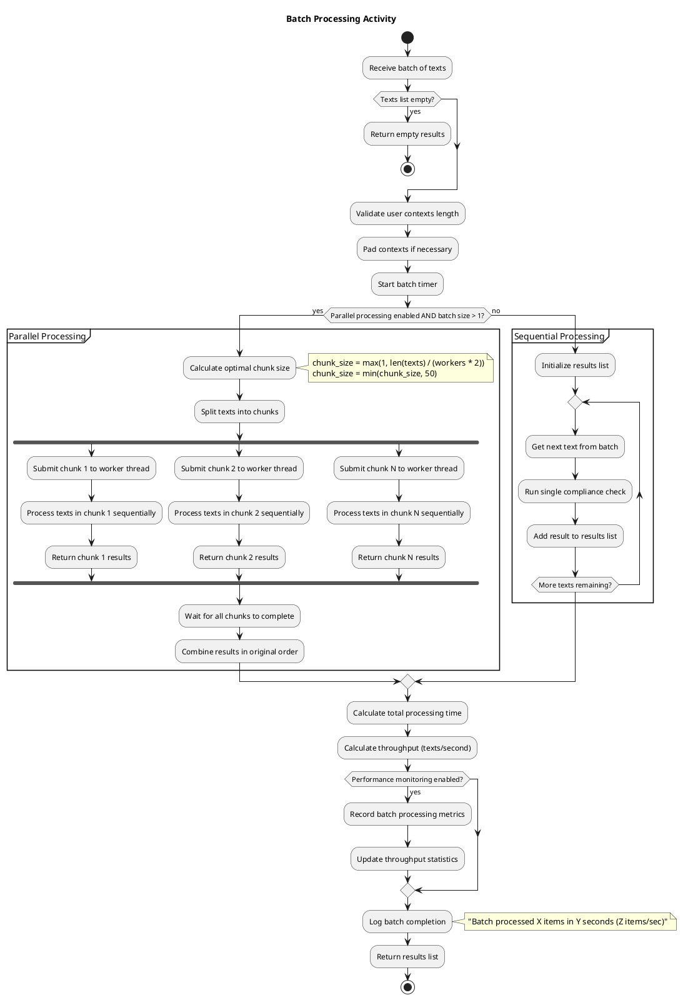
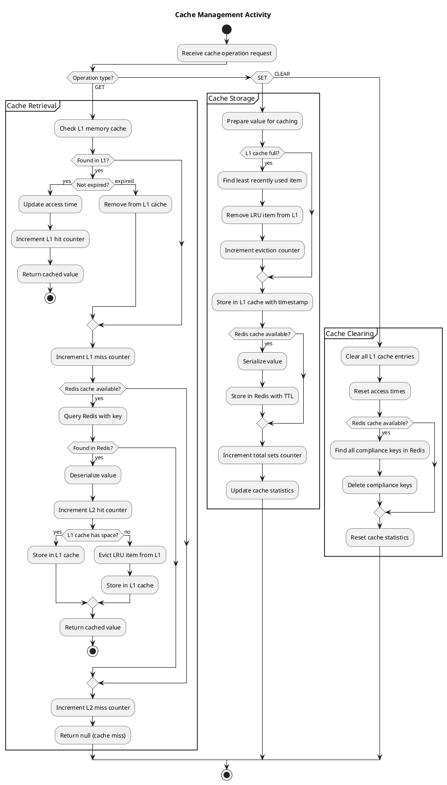
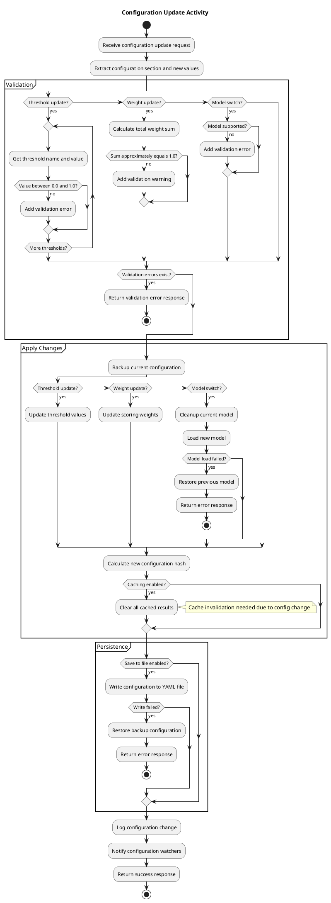
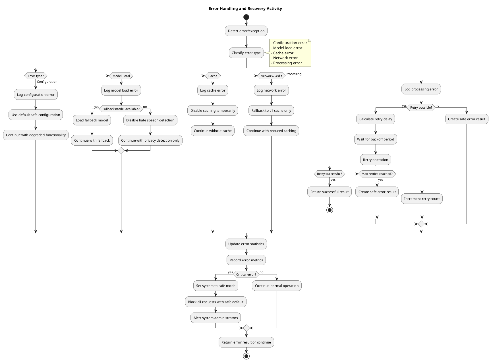

# Activity Diagrams - LLM Compliance Filter System

## Overview
This document contains activity diagrams for the LLM Compliance Filter System, showing the workflow and decision points in key processes.

## 1. Single Text Compliance Check Activity

```plantuml
@startuml SingleComplianceCheck
title Single Text Compliance Check Activity

start

:Receive text input and user context;

if (Is caching enabled?) then (yes)
    :Generate cache key from text + config;
    :Check L1 cache;
    if (Cache hit in L1?) then (yes)
        :Record cache hit metrics;
        :Return cached result;
        stop
    endif
    
    :Check L2 cache (Redis);
    if (Cache hit in L2?) then (yes)
        :Deserialize cached result;
        :Promote to L1 cache;
        :Record cache hit metrics;
        :Return cached result;
        stop
    endif
    
    :Record cache miss;
endif

:Start processing timer;

partition "Privacy Detection" {
    :Initialize privacy violations list;
    
    if (Email detection enabled?) then (yes)
        :Apply email regex patterns;
        :Add violations to list;
    endif
    
    if (Phone detection enabled?) then (yes)
        :Apply phone regex patterns;
        :Add violations to list;
    endif
    
    if (SSN detection enabled?) then (yes)
        :Apply SSN regex patterns;
        :Add violations to list;
    endif
    
    if (Credit card detection enabled?) then (yes)
        :Apply credit card patterns;
        :Add violations to list;
    endif
    
    if (Custom patterns enabled?) then (yes)
        :Apply custom regex patterns;
        :Add violations to list;
    endif
    
    if (NLP detection available?) then (yes)
        :Run spaCy NER;
        :Extract person, location, organization entities;
        :Add NLP violations to list;
    endif
    
    :Calculate privacy score from violations;
}

partition "Hate Speech Detection" {
    if (Hate speech detector available?) then (yes)
        :Load transformer model if not cached;
        :Tokenize input text;
        :Run model inference;
        :Parse model results;
        :Extract confidence scores;
        :Determine if hate speech detected;
    else (no)
        :Set hate speech score to 0;
    endif
}

:Calculate overall compliance score;
note right
    Using configured method:
    - weighted_average
    - max
    - product
end note

if (Score >= block threshold?) then (yes)
    :Set action to BLOCK;
elseif (Score >= warn threshold?) then (yes)
    :Set action to WARN;
else (no)
    :Set action to ALLOW;
endif

:Generate human-readable reasoning;

:Create ComplianceResult object;

:Stop processing timer;

if (Caching enabled?) then (yes)
    :Store result in cache;
    :Update cache statistics;
endif

if (Monitoring enabled?) then (yes)
    :Record processing metrics;
    :Update performance statistics;
endif

if (Audit logging enabled?) then (yes)
    :Log compliance check details;
    :Write to audit trail;
endif

:Return ComplianceResult;

stop

@enduml
```

## 2. Batch Processing Activity

## 3. Cache Management Activity

## 4. Configuration Update Activity

## 5. Error Handling and Recovery Activity

## 6. Performance Optimization Activity

```plantuml
@startuml PerformanceOptimization
title Performance Optimization Activity

start

:Monitor system performance metrics;

if (Memory usage > threshold?) then (yes)
    partition "Memory Optimization" {
        :Calculate current memory usage;
        
        if (Usage > 1GB?) then (yes)
            :Clear oldest 50% of cache entries;
            :Force garbage collection;
            :Log memory optimization;
        endif
        
        if (Cache size > limit?) then (yes)
            :Evict LRU cache entries;
            :Reduce cache size target;
        endif
    }
endif

if (Response time > SLA?) then (yes)
    partition "Performance Tuning" {
        :Analyze bottlenecks;
        
        if (Cache hit rate < 80%?) then (yes)
            :Increase cache size;
            :Extend cache TTL;
        endif
        
        if (Model inference slow?) then (yes)
            :Enable model warm-up;
            :Consider faster model;
        endif
        
        if (Batch size inefficient?) then (yes)
            :Adjust chunk size;
            :Optimize worker allocation;
        endif
    }
endif

if (Error rate > threshold?) then (yes)
    partition "Reliability Improvement" {
        :Identify error patterns;
        
        :Enable more aggressive retries;
        :Add circuit breakers;
        :Improve error recovery;
    }
endif

:Update performance configuration;
:Log optimization actions;

stop

@enduml
```

## Activity Diagram Analysis

### Key Process Flows:

1. **Single Compliance Check**: Linear flow with decision points for caching, detection methods, and scoring
2. **Batch Processing**: Fork/join pattern for parallel processing with sequential fallback
3. **Cache Management**: Multi-tier caching with LRU eviction and TTL management
4. **Configuration Updates**: Validation-first approach with rollback capability
5. **Error Handling**: Graceful degradation with retry logic and safe defaults
6. **Performance Optimization**: Reactive optimization based on metrics and thresholds

### Decision Points:

1. **Caching Strategy**: L1 → L2 → Process → Store
2. **Processing Mode**: Parallel vs Sequential based on batch size and resources
3. **Error Recovery**: Retry, fallback, or safe default based on error type
4. **Optimization Triggers**: Memory, performance, and reliability thresholds

### Performance Characteristics:

1. **Cache Hit Path**: ~1-5ms (immediate return)
2. **Cache Miss Path**: ~50-200ms (full processing)
3. **Parallel Processing**: Linear scalability with worker threads
4. **Error Recovery**: Graceful degradation without service interruption

### Optimization Strategies:

1. **Proactive Caching**: Cache warming and intelligent prefetching
2. **Adaptive Batching**: Dynamic chunk sizing based on performance
3. **Circuit Breaker**: Fail-fast for known problematic operations
4. **Graceful Degradation**: Continue with reduced functionality during failures

These activity diagrams provide a comprehensive view of the system's behavior, making it easier to understand the workflow, identify bottlenecks, and optimize performance.
