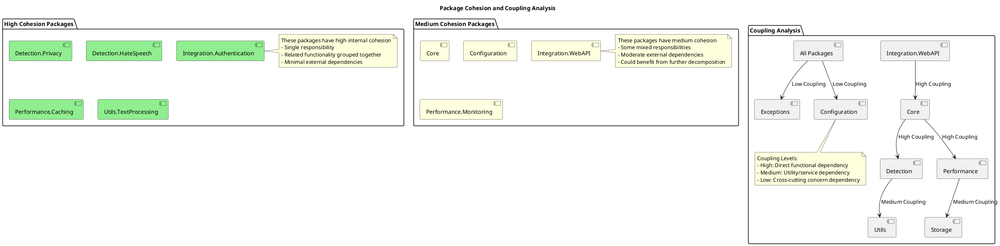
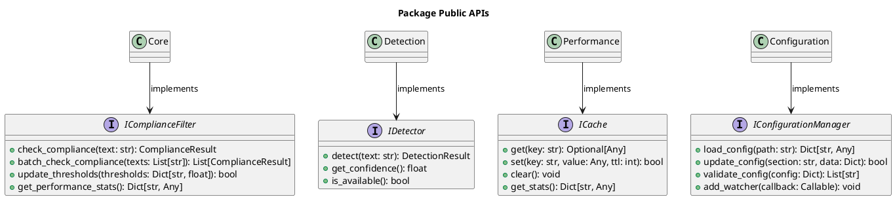

# Package Diagram - LLM Compliance Filter System

## Overview
This document contains the package diagram for the LLM Compliance Filter System, showing the system's modular structure and dependencies between packages.

## System Package Structure

```plantuml
@startuml PackageDiagram
title LLM Compliance Filter - Package Structure

!define COMPONENT [C]

package "LLM Compliance Filter System" {

    package "Core" {
        [ComplianceFilter] COMPONENT
        [ComplianceResult] COMPONENT
        [ComplianceAction] COMPONENT
        note right of ComplianceFilter
            Main orchestrator class
            Coordinates all detection systems
        end note
    }

    package "Detection" {
        package "Privacy" {
            [PrivacyDetector] COMPONENT
            [PrivacyViolation] COMPONENT
            [ViolationType] COMPONENT
        }
        
        package "HateSpeech" {
            [HateSpeechDetector] COMPONENT
            [HateSpeechResult] COMPONENT
        }
        
        note right of Detection
            Pluggable detection modules
            Independent processing pipelines
        end note
    }

    package "Performance" {
        package "Caching" {
            [IntelligentCache] COMPONENT
            [L1Cache] COMPONENT
            [L2Cache] COMPONENT
        }
        
        package "Monitoring" {
            [PerformanceMonitor] COMPONENT
            [PerformanceMetrics] COMPONENT
            [SystemMetrics] COMPONENT
        }
        
        package "Optimization" {
            [BatchProcessor] COMPONENT
            [ParallelExecutor] COMPONENT
            [MemoryOptimizer] COMPONENT
        }
    }

    package "Configuration" {
        [ConfigurationManager] COMPONENT
        [YAMLLoader] COMPONENT
        [ConfigValidator] COMPONENT
        [HotReloader] COMPONENT
        
        note right of Configuration
            Dynamic configuration management
            Hot-reload capabilities
        end note
    }

    package "Utils" {
        package "Text Processing" {
            [TextProcessor] COMPONENT
            [PatternMatcher] COMPONENT
            [EntityExtractor] COMPONENT
        }
        
        package "Data" {
            [Serializer] COMPONENT
            [Hasher] COMPONENT
            [Compressor] COMPONENT
        }
        
        package "Logging" {
            [Logger] COMPONENT
            [AuditLogger] COMPONENT
            [MetricsLogger] COMPONENT
        }
    }

    package "Integration" {
        package "Web API" {
            [FlaskApp] COMPONENT
            [APIController] COMPONENT
            [RequestValidator] COMPONENT
            [ResponseFormatter] COMPONENT
        }
        
        package "Client SDKs" {
            [PythonClient] COMPONENT
            [AsyncPythonClient] COMPONENT
            [JavaScriptClient] COMPONENT
        }
        
        package "Authentication" {
            [AuthManager] COMPONENT
            [APIKeyValidator] COMPONENT
            [SessionManager] COMPONENT
            [RateLimiter] COMPONENT
        }
    }

    package "Storage" {
        package "Database" {
            [DatabaseManager] COMPONENT
            [MigrationManager] COMPONENT
            [ConnectionPool] COMPONENT
        }
        
        package "File System" {
            [FileManager] COMPONENT
            [ModelStorage] COMPONENT
            [ConfigStorage] COMPONENT
        }
        
        package "External Cache" {
            [RedisClient] COMPONENT
            [CacheSerializer] COMPONENT
        }
    }

    package "Exceptions" {
        [ComplianceFilterException] COMPONENT
        [ConfigurationError] COMPONENT
        [ModelLoadError] COMPONENT
        [CacheError] COMPONENT
        [ValidationError] COMPONENT
        [ErrorHandler] COMPONENT
        
        note right of Exceptions
            Centralized error handling
            Consistent error responses
        end note
    }

    package "External Dependencies" {
        package "Machine Learning" {
            [TransformersLib] COMPONENT
            [TorchLib] COMPONENT
            [SpacyLib] COMPONENT
        }
        
        package "Web Framework" {
            [Flask] COMPONENT
            [Requests] COMPONENT
            [AsyncIO] COMPONENT
        }
        
        package "Data Storage" {
            [Redis] COMPONENT
            [SQLAlchemy] COMPONENT
            [PyYAML] COMPONENT
        }
        
        package "Utilities" {
            [NumPy] COMPONENT
            [Pandas] COMPONENT
            [PSUtil] COMPONENT
        }
    }
}

' Core Dependencies
Core --> Detection : uses
Core --> Performance : uses
Core --> Configuration : uses
Core --> Utils : uses
Core --> Exceptions : handles

' Detection Dependencies
Detection --> Utils : uses
Detection --> Configuration : reads
Detection --> Exceptions : throws
Privacy --> External Dependencies : uses
HateSpeech --> External Dependencies : uses

' Performance Dependencies
Performance --> Storage : uses
Performance --> Utils : uses
Performance --> Configuration : reads
Caching --> External Dependencies : uses
Monitoring --> External Dependencies : uses

' Configuration Dependencies
Configuration --> Storage : reads/writes
Configuration --> Utils : uses
Configuration --> External Dependencies : uses

' Integration Dependencies
Integration --> Core : uses
Integration --> Authentication : secured by
Integration --> Utils : uses
Integration --> Configuration : reads
Web API --> External Dependencies : uses
Client SDKs --> Web API : calls

' Storage Dependencies
Storage --> External Dependencies : uses
Storage --> Configuration : reads
Storage --> Exceptions : throws

' External Dependencies (shown as provided interfaces)
External Dependencies --> Detection : provides ML models
External Dependencies --> Performance : provides caching
External Dependencies --> Integration : provides web framework
External Dependencies --> Storage : provides data persistence

@enduml
```

## Package Dependency Analysis

### Dependency Layers (Top to Bottom):

1. **External Dependencies Layer**
   - Third-party libraries and frameworks
   - Provides foundational capabilities

2. **Utilities Layer**
   - Cross-cutting concerns (logging, text processing, data utilities)
   - Used by all other layers

3. **Configuration Layer**
   - System configuration management
   - Hot-reload and validation capabilities

4. **Storage Layer**
   - Data persistence and caching
   - File system and database management

5. **Detection Layer**
   - Privacy and hate speech detection modules
   - Independent processing pipelines

6. **Performance Layer**
   - Caching, monitoring, and optimization
   - Performance enhancement components

7. **Core Layer**
   - Main orchestrator and result types
   - System entry points

8. **Integration Layer**
   - Web API and client SDKs
   - External system interfaces

9. **Exception Handling Layer**
   - Cross-cutting error management
   - Consistent error responses

### Package Cohesion Analysis



## Detailed Package Descriptions

### Core Package
**Purpose**: Main system orchestration and public interfaces
**Components**:
- `ComplianceFilter`: Primary facade for all compliance operations
- `ComplianceResult`: Standardized result format
- `ComplianceAction`: Action enumeration (ALLOW, WARN, BLOCK)

**Dependencies**: Detection, Performance, Configuration, Utils, Exceptions

### Detection Package
**Purpose**: Content analysis and violation detection
**Sub-packages**:
- **Privacy**: PII detection using regex patterns and NLP
- **HateSpeech**: Toxic content detection using transformer models

**Design Pattern**: Strategy pattern for pluggable detectors
**Dependencies**: Utils (text processing), Configuration, External ML libraries

### Performance Package  
**Purpose**: System optimization and monitoring
**Sub-packages**:
- **Caching**: Multi-tier intelligent caching (L1 + Redis)
- **Monitoring**: Real-time performance metrics collection
- **Optimization**: Batch processing and parallel execution

**Design Pattern**: Decorator pattern for performance enhancements
**Dependencies**: Storage, Utils, Configuration

### Configuration Package
**Purpose**: Dynamic system configuration management
**Components**:
- `ConfigurationManager`: Central configuration coordinator
- `YAMLLoader`: YAML file processing
- `ConfigValidator`: Configuration validation rules
- `HotReloader`: Live configuration updates

**Design Pattern**: Observer pattern for configuration changes
**Dependencies**: Storage, Utils, External YAML library

### Utils Package
**Purpose**: Shared utilities and cross-cutting concerns
**Sub-packages**:
- **Text Processing**: Text normalization, pattern matching, feature extraction
- **Data**: Serialization, hashing, compression utilities
- **Logging**: Structured logging, audit trails, metrics logging

**Design Pattern**: Utility/Helper pattern
**Dependencies**: External libraries (minimal)

### Integration Package
**Purpose**: External system interfaces and client access
**Sub-packages**:
- **Web API**: REST API implementation with Flask
- **Client SDKs**: Python sync/async clients, JavaScript client
- **Authentication**: API key management, session handling, rate limiting

**Design Pattern**: Facade pattern for external interfaces
**Dependencies**: Core, Authentication, Utils, External web frameworks

### Storage Package
**Purpose**: Data persistence and external storage management
**Sub-packages**:
- **Database**: SQL database operations and migrations
- **File System**: Model and configuration file management
- **External Cache**: Redis integration and cache serialization

**Design Pattern**: Repository pattern for data access
**Dependencies**: Configuration, External storage libraries

### Exceptions Package
**Purpose**: Centralized error handling and exception management
**Components**:
- Custom exception hierarchy for different error types
- `ErrorHandler`: Consistent error processing and recovery
- Error classification and logging utilities

**Design Pattern**: Chain of Responsibility for error handling
**Dependencies**: Utils (logging)

## Deployment Package Structure

```plantuml
@startuml DeploymentPackages
title Deployment Package Structure

package "Core Service" {
    [llm-compliance-filter-core.tar.gz]
    note right
        - Core package
        - Detection packages
        - Performance packages
        - Configuration package
        - Utils package
        - Exceptions package
    end note
}

package "Web API Service" {
    [llm-compliance-filter-api.tar.gz]
    note right
        - Integration.WebAPI package
        - Integration.Authentication package
        - Dependencies: Core Service
    end note
}

package "Client Libraries" {
    [python-compliance-client.whl]
    [javascript-compliance-client.npm]
    [java-compliance-client.jar]
    
    note right
        - Client SDK packages
        - Language-specific implementations
        - Independent of core service
    end note
}

package "Docker Images" {
    [compliance-filter:latest]
    [compliance-api:latest]
    [compliance-redis:latest]
    
    note right
        - Containerized deployment
        - Multi-stage builds
        - Optimized for production
    end note
}

@enduml
```



## Package Interface Contracts

### Public APIs



## Benefits of This Package Structure

### 1. **Modularity**
- Clear separation of concerns
- Independent development and testing
- Pluggable components

### 2. **Maintainability**
- Localized changes within packages
- Clear dependency management
- Consistent interfaces

### 3. **Scalability**
- Independent scaling of components
- Microservice-ready architecture
- Horizontal scaling support

### 4. **Testability**
- Unit testing at package level
- Mock dependencies easily
- Integration testing across packages

### 5. **Deployability**
- Flexible deployment options
- Docker containerization
- Independent service deployment

This package structure provides a solid foundation for building, maintaining, and scaling the LLM Compliance Filter system while ensuring clean separation of concerns and manageable dependencies.
