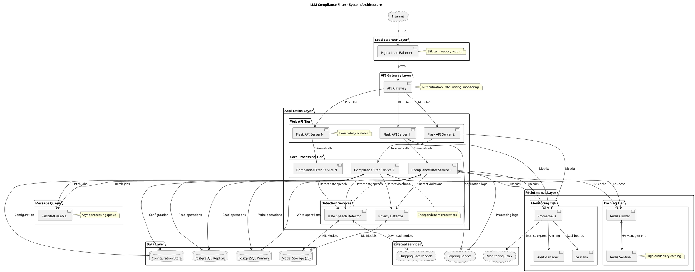

# Database Schema and System Architecture - LLM Compliance Filter System

## Database Schema Implementation

### PostgreSQL Database Schema

```sql
-- =====================================
-- LLM COMPLIANCE FILTER DATABASE SCHEMA
-- =====================================

-- Enable UUID extension
CREATE EXTENSION IF NOT EXISTS "uuid-ossp";
CREATE EXTENSION IF NOT EXISTS "pg_trgm"; -- For text search optimization

-- =====================================
-- CORE TABLES
-- =====================================

-- Compliance Check Results
CREATE TABLE compliance_checks (
    id UUID PRIMARY KEY DEFAULT uuid_generate_v4(),
    request_id VARCHAR(255) NOT NULL,
    input_text TEXT NOT NULL,
    input_hash VARCHAR(64) NOT NULL, -- SHA-256 hash of input
    user_context JSONB DEFAULT '{}',
    timestamp TIMESTAMPTZ NOT NULL DEFAULT NOW(),
    processing_time_ms DECIMAL(10,3) NOT NULL,
    
    -- Results
    overall_score DECIMAL(5,3) NOT NULL CHECK (overall_score >= 0 AND overall_score <= 1),
    action VARCHAR(10) NOT NULL CHECK (action IN ('ALLOW', 'WARN', 'BLOCK')),
    reasoning TEXT NOT NULL,
    
    -- Configuration snapshot
    configuration_hash VARCHAR(32) NOT NULL,
    hate_speech_threshold DECIMAL(5,3),
    privacy_threshold DECIMAL(5,3),
    scoring_method VARCHAR(20),
    
    -- Indexing
    CONSTRAINT compliance_checks_action_check CHECK (action IN ('ALLOW', 'WARN', 'BLOCK'))
);

-- Privacy Violations
CREATE TABLE privacy_violations (
    id UUID PRIMARY KEY DEFAULT uuid_generate_v4(),
    check_id UUID NOT NULL REFERENCES compliance_checks(id) ON DELETE CASCADE,
    violation_type VARCHAR(30) NOT NULL,
    confidence DECIMAL(5,3) NOT NULL CHECK (confidence >= 0 AND confidence <= 1),
    text_span TEXT NOT NULL,
    start_position INTEGER NOT NULL,
    end_position INTEGER NOT NULL,
    description TEXT NOT NULL,
    detected_value_hash VARCHAR(64) -- Hashed PII for audit
);

-- Hate Speech Results
CREATE TABLE hate_speech_results (
    id UUID PRIMARY KEY DEFAULT uuid_generate_v4(),
    check_id UUID NOT NULL REFERENCES compliance_checks(id) ON DELETE CASCADE,
    is_hate_speech BOOLEAN NOT NULL,
    confidence DECIMAL(5,3) NOT NULL CHECK (confidence >= 0 AND confidence <= 1),
    primary_label VARCHAR(50) NOT NULL,
    model_name VARCHAR(100) NOT NULL,
    processing_time_ms DECIMAL(8,3) NOT NULL,
    all_scores JSONB NOT NULL DEFAULT '{}'
);

-- =====================================
-- PERFORMANCE AND MONITORING
-- =====================================

-- System Performance Metrics
CREATE TABLE performance_metrics (
    id UUID PRIMARY KEY DEFAULT uuid_generate_v4(),
    timestamp TIMESTAMPTZ NOT NULL DEFAULT NOW(),
    window_start TIMESTAMPTZ NOT NULL,
    window_end TIMESTAMPTZ NOT NULL,
    
    -- Request metrics
    total_requests INTEGER NOT NULL DEFAULT 0,
    cache_hits INTEGER NOT NULL DEFAULT 0,
    cache_misses INTEGER NOT NULL DEFAULT 0,
    
    -- Response time metrics
    avg_response_time_ms DECIMAL(10,3) NOT NULL DEFAULT 0,
    p95_response_time_ms DECIMAL(10,3) NOT NULL DEFAULT 0,
    p99_response_time_ms DECIMAL(10,3) NOT NULL DEFAULT 0,
    
    -- System metrics
    memory_usage_mb DECIMAL(10,2) NOT NULL DEFAULT 0,
    cpu_usage_percent DECIMAL(5,2) NOT NULL DEFAULT 0,
    requests_per_second DECIMAL(10,3) NOT NULL DEFAULT 0,
    error_rate DECIMAL(5,3) NOT NULL DEFAULT 0
);

-- Cache Statistics
CREATE TABLE cache_statistics (
    id UUID PRIMARY KEY DEFAULT uuid_generate_v4(),
    timestamp TIMESTAMPTZ NOT NULL DEFAULT NOW(),
    cache_tier VARCHAR(10) NOT NULL CHECK (cache_tier IN ('L1', 'L2', 'COMBINED')),
    
    total_requests INTEGER NOT NULL DEFAULT 0,
    hits INTEGER NOT NULL DEFAULT 0,
    misses INTEGER NOT NULL DEFAULT 0,
    hit_rate_percent DECIMAL(5,2) NOT NULL DEFAULT 0,
    evictions INTEGER NOT NULL DEFAULT 0,
    cache_size INTEGER NOT NULL DEFAULT 0,
    memory_usage_mb DECIMAL(10,2) NOT NULL DEFAULT 0
);

-- Error Logs
CREATE TABLE error_logs (
    id UUID PRIMARY KEY DEFAULT uuid_generate_v4(),
    timestamp TIMESTAMPTZ NOT NULL DEFAULT NOW(),
    error_type VARCHAR(50) NOT NULL,
    severity VARCHAR(20) NOT NULL CHECK (severity IN ('LOW', 'MEDIUM', 'HIGH', 'CRITICAL')),
    component VARCHAR(50) NOT NULL,
    error_message TEXT NOT NULL,
    stack_trace TEXT,
    context_data JSONB DEFAULT '{}',
    request_id VARCHAR(255),
    resolved BOOLEAN NOT NULL DEFAULT FALSE
);

-- =====================================
-- CONFIGURATION AND AUDIT
-- =====================================

-- System Configuration
CREATE TABLE system_configurations (
    id UUID PRIMARY KEY DEFAULT uuid_generate_v4(),
    config_name VARCHAR(100) NOT NULL UNIQUE,
    config_version VARCHAR(20) NOT NULL,
    created_at TIMESTAMPTZ NOT NULL DEFAULT NOW(),
    is_active BOOLEAN NOT NULL DEFAULT FALSE,
    
    -- Configuration data
    hate_speech_threshold DECIMAL(5,3) NOT NULL DEFAULT 0.7,
    privacy_thresholds JSONB NOT NULL DEFAULT '{}',
    scoring_method VARCHAR(20) NOT NULL DEFAULT 'weighted_average',
    scoring_weights JSONB NOT NULL DEFAULT '{"hate_speech": 0.6, "privacy": 0.4}',
    action_thresholds JSONB NOT NULL DEFAULT '{"block": 0.7, "warn": 0.5, "pass": 0.2}'
);

-- Configuration History
CREATE TABLE configuration_history (
    id UUID PRIMARY KEY DEFAULT uuid_generate_v4(),
    config_id UUID NOT NULL REFERENCES system_configurations(id),
    changed_by VARCHAR(255) NOT NULL,
    changed_at TIMESTAMPTZ NOT NULL DEFAULT NOW(),
    change_type VARCHAR(10) NOT NULL CHECK (change_type IN ('CREATE', 'UPDATE', 'DELETE')),
    field_name VARCHAR(100),
    old_value TEXT,
    new_value TEXT,
    change_reason TEXT
);

-- Audit Logs
CREATE TABLE audit_logs (
    id UUID PRIMARY KEY DEFAULT uuid_generate_v4(),
    timestamp TIMESTAMPTZ NOT NULL DEFAULT NOW(),
    event_type VARCHAR(50) NOT NULL,
    user_id VARCHAR(255),
    resource_type VARCHAR(50),
    resource_id VARCHAR(255),
    old_values JSONB,
    new_values JSONB,
    ip_address INET,
    user_agent TEXT
);

-- =====================================
-- BATCH PROCESSING
-- =====================================

-- Batch Processing Jobs
CREATE TABLE batch_processing (
    id UUID PRIMARY KEY DEFAULT uuid_generate_v4(),
    batch_id VARCHAR(255) NOT NULL UNIQUE,
    submitted_at TIMESTAMPTZ NOT NULL DEFAULT NOW(),
    completed_at TIMESTAMPTZ,
    status VARCHAR(20) NOT NULL DEFAULT 'PENDING' 
        CHECK (status IN ('PENDING', 'PROCESSING', 'COMPLETED', 'FAILED')),
    
    total_items INTEGER NOT NULL DEFAULT 0,
    processed_items INTEGER NOT NULL DEFAULT 0,
    failed_items INTEGER NOT NULL DEFAULT 0,
    processing_time_ms DECIMAL(15,3),
    
    configuration_id UUID REFERENCES system_configurations(id),
    error_message TEXT
);

-- =====================================
-- INDEXES FOR PERFORMANCE
-- =====================================

-- Primary lookup indexes
CREATE INDEX idx_compliance_checks_timestamp ON compliance_checks(timestamp DESC);
CREATE INDEX idx_compliance_checks_hash ON compliance_checks(input_hash);
CREATE INDEX idx_compliance_checks_request_id ON compliance_checks(request_id);
CREATE INDEX idx_compliance_checks_action ON compliance_checks(action, timestamp);

-- Foreign key indexes
CREATE INDEX idx_privacy_violations_check_id ON privacy_violations(check_id);
CREATE INDEX idx_hate_speech_results_check_id ON hate_speech_results(check_id);

-- Performance monitoring indexes
CREATE INDEX idx_performance_metrics_timestamp ON performance_metrics(timestamp DESC);
CREATE INDEX idx_performance_metrics_window ON performance_metrics(window_start, window_end);
CREATE INDEX idx_cache_statistics_timestamp ON cache_statistics(timestamp DESC);
CREATE INDEX idx_error_logs_timestamp ON error_logs(timestamp DESC);
CREATE INDEX idx_error_logs_severity ON error_logs(severity, timestamp DESC);
CREATE INDEX idx_error_logs_component ON error_logs(component, timestamp DESC);

-- Configuration and audit indexes
CREATE INDEX idx_system_configurations_active ON system_configurations(is_active, created_at DESC);
CREATE INDEX idx_configuration_history_config_id ON configuration_history(config_id, changed_at DESC);
CREATE INDEX idx_audit_logs_timestamp ON audit_logs(timestamp DESC);
CREATE INDEX idx_audit_logs_event_type ON audit_logs(event_type, timestamp DESC);
CREATE INDEX idx_audit_logs_user_id ON audit_logs(user_id, timestamp DESC);

-- Batch processing indexes
CREATE INDEX idx_batch_processing_status ON batch_processing(status, submitted_at);
CREATE INDEX idx_batch_processing_batch_id ON batch_processing(batch_id);

-- Text search indexes
CREATE INDEX idx_compliance_checks_text_search ON compliance_checks 
    USING gin(to_tsvector('english', reasoning));

-- Composite indexes for common queries
CREATE INDEX idx_compliance_checks_action_score ON compliance_checks(action, overall_score, timestamp);
CREATE INDEX idx_privacy_violations_type_confidence ON privacy_violations(violation_type, confidence);

-- =====================================
-- VIEWS FOR REPORTING
-- =====================================

-- Daily compliance summary
CREATE VIEW daily_compliance_summary AS
SELECT 
    DATE(timestamp) as date,
    COUNT(*) as total_checks,
    COUNT(CASE WHEN action = 'ALLOW' THEN 1 END) as allowed,
    COUNT(CASE WHEN action = 'WARN' THEN 1 END) as warned,
    COUNT(CASE WHEN action = 'BLOCK' THEN 1 END) as blocked,
    AVG(overall_score) as avg_score,
    AVG(processing_time_ms) as avg_processing_time
FROM compliance_checks
GROUP BY DATE(timestamp)
ORDER BY date DESC;

-- Privacy violation summary
CREATE VIEW privacy_violation_summary AS
SELECT 
    violation_type,
    COUNT(*) as violation_count,
    AVG(confidence) as avg_confidence,
    MAX(confidence) as max_confidence
FROM privacy_violations
GROUP BY violation_type
ORDER BY violation_count DESC;

-- Performance trends
CREATE VIEW performance_trends AS
SELECT 
    DATE_TRUNC('hour', timestamp) as hour,
    AVG(avg_response_time_ms) as avg_response_time,
    AVG(requests_per_second) as avg_rps,
    AVG(error_rate) as avg_error_rate,
    AVG(memory_usage_mb) as avg_memory_usage
FROM performance_metrics
GROUP BY DATE_TRUNC('hour', timestamp)
ORDER BY hour DESC;
```

## System Architecture Diagram



## Deployment Architecture

```plantuml
@startuml DeploymentArchitecture
title Deployment Architecture - Production Environment

node "Load Balancer Cluster" {
    [Nginx LB 1] as lb1
    [Nginx LB 2] as lb2
    note right: Active-Passive HA
}

node "Kubernetes Cluster" {
    package "API Namespace" {
        pod "API Pod 1" {
            [Flask API]
            [Gunicorn WSGI]
        }
        pod "API Pod 2" {
            [Flask API]
            [Gunicorn WSGI]
        }
        pod "API Pod N" {
            [Flask API]
            [Gunicorn WSGI]
        }
    }
    
    package "Core Namespace" {
        pod "Core Pod 1" {
            [ComplianceFilter]
            [Detection Services]
        }
        pod "Core Pod 2" {
            [ComplianceFilter]
            [Detection Services]
        }
    }
    
    package "Cache Namespace" {
        pod "Redis Master" {
            [Redis Server]
        }
        pod "Redis Replica 1" {
            [Redis Server]
        }
        pod "Redis Replica 2" {
            [Redis Server]
        }
    }
    
    package "Monitoring Namespace" {
        pod "Prometheus" {
            [Prometheus Server]
        }
        pod "Grafana" {
            [Grafana Server]
        }
    }
}

node "Database Cluster" {
    [PostgreSQL Primary] as db1
    [PostgreSQL Standby 1] as db2
    [PostgreSQL Standby 2] as db3
    
    db1 --> db2 : Streaming replication
    db1 --> db3 : Streaming replication
}

node "Object Storage" {
    [AWS S3 / MinIO] as storage
    note right: ML models, configs, backups
}

node "Monitoring & Logging" {
    [ELK Stack / Fluentd]
    [Prometheus AlertManager]
    [PagerDuty / Slack]
}

' Network connections
lb1 -.-> "API Namespace" : Load balance
lb2 -.-> "API Namespace" : Failover
"API Namespace" --> "Core Namespace" : Service calls
"Core Namespace" --> "Cache Namespace" : Caching
"Core Namespace" --> "Database Cluster" : Data persistence
"Core Namespace" <--> storage : Model/config access

@enduml
```

## Data Flow Architecture

```plantuml
@startuml DataFlowArchitecture
title Data Flow Architecture

actor "Client Application" as client
participant "Load Balancer" as lb
participant "API Gateway" as gw
participant "Flask API" as api
participant "ComplianceFilter" as filter
participant "Redis Cache" as cache
participant "Privacy Detector" as privacy
participant "Hate Speech Detector" as hate
participant "PostgreSQL" as db
participant "Monitoring" as mon

client -> lb : HTTPS Request
lb -> gw : Route request
gw -> api : Authenticated request
api -> filter : check_compliance()

alt Cache Hit
    filter -> cache : Check cache
    cache -> filter : Return cached result
    filter -> api : ComplianceResult
else Cache Miss
    filter -> cache : Cache miss
    
    par Privacy Detection
        filter -> privacy : detect_violations()
        privacy -> privacy : Regex + NLP processing
        privacy -> filter : PrivacyViolations[]
    and Hate Speech Detection
        filter -> hate : detect_hate_speech()
        hate -> hate : Transformer inference
        hate -> filter : HateSpeechResult
    end
    
    filter -> filter : Calculate scores
    filter -> filter : Determine action
    
    filter -> cache : Store result
    filter -> db : Log compliance check
    filter -> api : ComplianceResult
end

api -> mon : Record metrics
api -> client : JSON response

@enduml
```

## Performance Characteristics

### Scalability Metrics
- **Horizontal Scaling**: Auto-scaling based on CPU/memory utilization
- **Throughput**: 1000+ requests/second per pod
- **Cache Hit Rate**: 80-95% for repeated content
- **Database Connections**: Connection pooling with max 100 connections per pod

### High Availability Features
- **Load Balancer**: Active-passive configuration with health checks
- **API Services**: Multiple replicas with rolling updates
- **Database**: Primary-replica setup with automatic failover
- **Cache**: Redis cluster with sentinel for HA
- **Monitoring**: Real-time alerting and automated recovery

### Security Architecture
- **Network Security**: VPC with private subnets, security groups
- **API Security**: JWT tokens, API key authentication, rate limiting
- **Data Security**: Encryption at rest and in transit, PII hashing
- **Access Control**: RBAC with principle of least privilege

This comprehensive architecture provides a production-ready, scalable, and maintainable system for LLM compliance filtering with enterprise-grade features.
