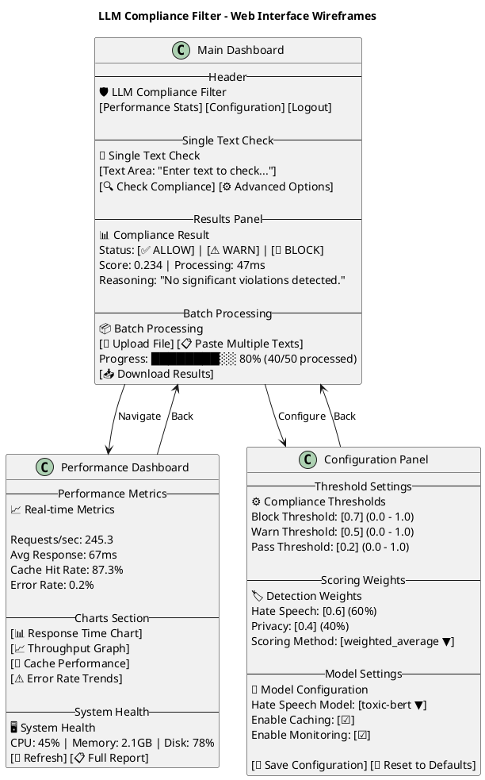
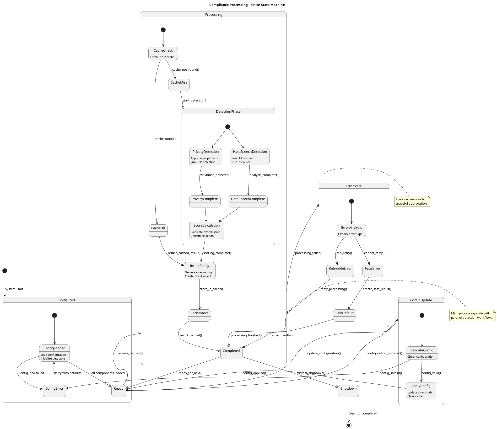
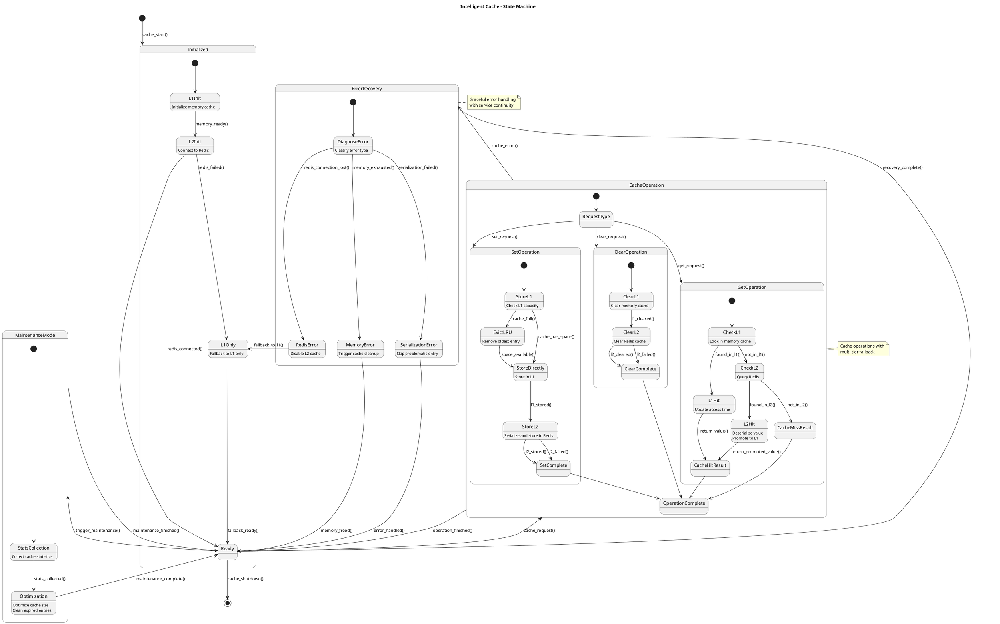
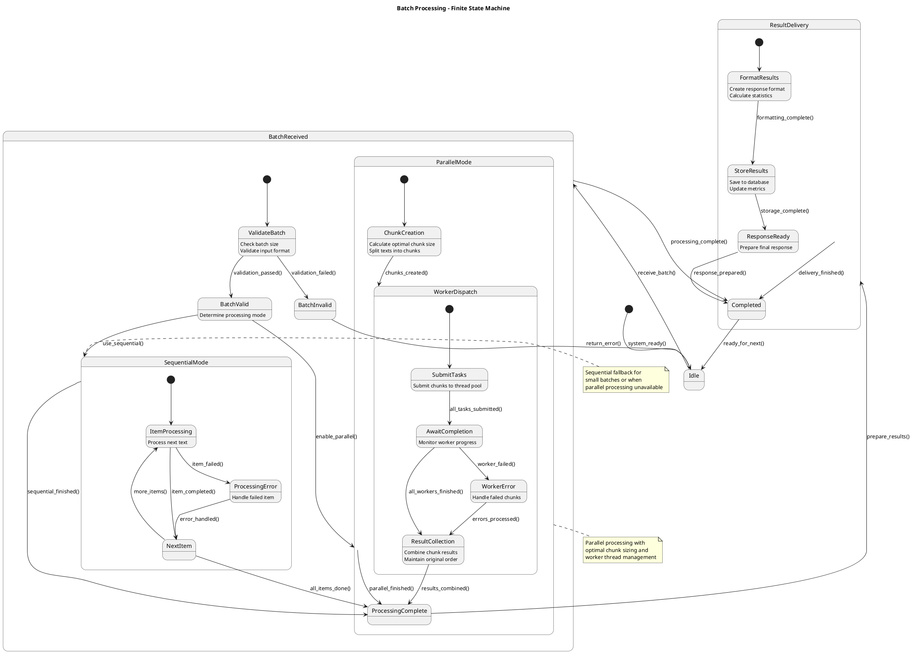

# UI Wireframes and FSM Diagram - LLM Compliance Filter System

## UI Mockups and Wireframes

### Web Interface Wireframes



### Mobile-Responsive Wireframes

```plantuml
@startuml MobileWireframes
title Mobile-Responsive Interface

RECTANGLE "Mobile Main View" as mobile_main {
    ╔════════════════════════╗
    ║ 🛡️ Compliance Filter   ║
    ║                        ║
    ║ 📝 Check Text          ║
    ║ ┌──────────────────┐   ║
    ║ │ Enter text here  │   ║
    ║ │                  │   ║
    ║ │                  │   ║
    ║ └──────────────────┘   ║
    ║ [🔍 Check]             ║
    ║                        ║
    ║ 📊 Last Result:        ║
    ║ ✅ ALLOW (Score: 0.23) ║
    ║                        ║
    ║ ═══ Navigation ═══     ║
    ║ [📊] [⚙️] [📦] [📈]    ║
    ╚════════════════════════╝
}

RECTANGLE "Mobile Result View" as mobile_result {
    ╔════════════════════════╗
    ║ 📊 Compliance Result   ║
    ║                        ║
    ║ 🚫 BLOCK               ║
    ║ Score: 0.847           ║
    ║ Time: 134ms            ║
    ║                        ║
    ║ 📝 Reasoning:          ║
    ║ Privacy violations     ║
    ║ detected: email, phone ║
    ║                        ║
    ║ 🔍 Violations Found:   ║
    ║ • Email: j***@test.com ║
    ║ • Phone: (555) ***-*** ║
    ║                        ║
    ║ [🔙 Back] [📋 Details]  ║
    ╚════════════════════════╝
}

mobile_main --> mobile_result : Check Text
mobile_result --> mobile_main : Back

@enduml
```

### API Documentation Interface

```plantuml
@startuml APIDocumentation
title API Documentation Interface

RECTANGLE "API Documentation Portal" as api_docs {
    -- Header --
    📚 LLM Compliance Filter API Documentation v2.1
    [🏠 Home] [🔐 Authentication] [🧪 Try It] [📥 Download SDK]
    
    -- Navigation Sidebar --
    📑 Contents
    • Getting Started
    • Authentication
    • Endpoints
      ├─ POST /api/check
      ├─ POST /api/batch
      ├─ GET /api/stats
      └─ PUT /api/config
    • Response Formats
    • Error Codes
    • SDKs & Examples
    • Rate Limits
    
    -- Main Content Area --
    🚀 Getting Started
    
    Base URL: https://api.compliance-filter.com/v2
    
    📋 Quick Example:
    ```json
    POST /api/check
    {
      "text": "Hello world",
      "user_context": {"user_id": "123"}
    }
    ```
    
    📤 Response:
    ```json
    {
      "action": "ALLOW",
      "score": 0.234,
      "reasoning": "No violations detected",
      "processing_time": 0.047
    }
    ```
    
    -- Interactive Section --
    🧪 Try It Live
    [Text Input Field]
    [Send Request] [🔄 Loading...]
    [Response Display Area]
}

RECTANGLE "Endpoint Details" as endpoint_details {
    -- Endpoint Specification --
    🎯 POST /api/check
    
    📝 Description:
    Check a single text for compliance violations
    
    📥 Request Body:
    ```json
    {
      "text": "string (required)",
      "user_context": "object (optional)",
      "use_cache": "boolean (optional)"
    }
    ```
    
    📤 Response Format:
    ```json
    {
      "action": "ALLOW|WARN|BLOCK",
      "score": "number (0.0-1.0)",
      "hate_speech_score": "number",
      "privacy_score": "number",
      "violations": ["array"],
      "reasoning": "string",
      "processing_time": "number",
      "timestamp": "string"
    }
    ```
    
    ⚠️ Error Responses:
    • 400: Bad Request
    • 401: Unauthorized
    • 429: Rate Limited
    • 500: Internal Error
    
    📊 Rate Limits:
    • 1000 requests/hour (authenticated)
    • 100 requests/hour (unauthenticated)
}

api_docs --> endpoint_details : View Endpoint
endpoint_details --> api_docs : Back to Docs

@enduml
```

## Finite State Machine Diagram

### Compliance Processing FSM



### Cache State Machine



### Batch Processing FSM



## UI/UX Design Principles

### Design Guidelines

1. **Clarity and Simplicity**
   - Clean, uncluttered interface
   - Clear visual hierarchy
   - Consistent navigation patterns

2. **Real-time Feedback**
   - Immediate compliance results
   - Live performance metrics
   - Progress indicators for batch processing

3. **Accessibility**
   - WCAG 2.1 AA compliance
   - Keyboard navigation support
   - Screen reader compatibility
   - High contrast mode

4. **Responsive Design**
   - Mobile-first approach
   - Adaptive layouts for different screen sizes
   - Touch-friendly interface elements

5. **Performance Optimization**
   - Progressive loading
   - Efficient data visualization
   - Minimal network requests

### Color Coding System

- **Green (#28a745)**: ALLOW actions, success states
- **Yellow (#ffc107)**: WARN actions, caution states
- **Red (#dc3545)**: BLOCK actions, error states
- **Blue (#007bff)**: Information, processing states
- **Gray (#6c757d)**: Neutral states, disabled elements

### Interactive Elements

- **Buttons**: Rounded corners with hover effects
- **Form Fields**: Clear labels with validation feedback
- **Charts**: Interactive with tooltips and zoom capabilities
- **Tables**: Sortable columns with search/filter options
- **Modals**: Overlay dialogs for detailed information

This comprehensive UI design provides an intuitive and efficient interface for managing the LLM Compliance Filter system, supporting both technical users and business stakeholders with appropriate levels of detail and control.
